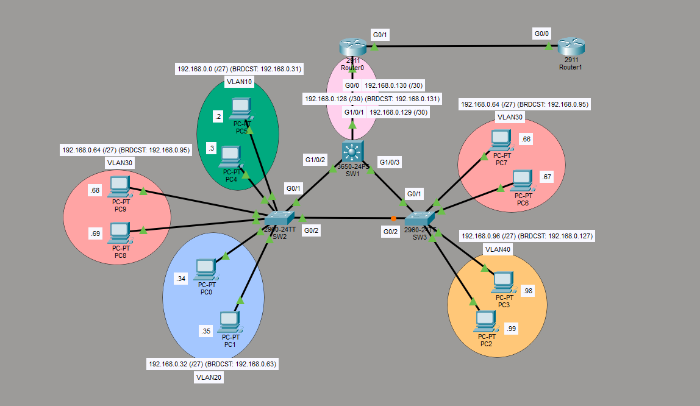

# Layer 3 Switch Inter-VLAN Routing + STP Lab

## Overview

This lab demonstrates a multi-switch network using a Layer 3 switch as the core device for inter-VLAN routing, combined with a redundant triangle topology to explore Spanning Tree Protocol behavior.

The 3650 multilayer switch acts as the root bridge and performs inter-VLAN routing via Switch Virtual Interfaces (SVIs). Access switches provide Layer 2 connectivity for end devices across multiple VLANs using Variable Length Subnet Masking (VLSM).

## Topology

- **SW1**: Cisco 3650-24PS (Layer 3 Switch / Root Bridge)
- **SW2**: Cisco 2960-24TT (Access Switch)
- **SW3**: Cisco 2960-24TT (Access Switch)
- **Router0**: Cisco 2911 (connected to SW1 via /30 link)
- **Router1**: External router (future expansion / internet edge)

Triangle topology between SW1, SW2, and SW3 creates a redundant Layer 2 path for STP demonstration.

## Network Design

### VLANs & Addressing (VLSM)

| VLAN | Purpose       | Subnet            | Usable Range          | Gateway (SVI)     |
|------|---------------|-------------------|-----------------------|-------------------|
| 10   | Users         | 192.168.0.0/27    | 192.168.0.1 – .30     | 192.168.0.1       |
| 20   | Servers       | 192.168.0.32/27   | 192.168.0.33 – .62    | 192.168.0.33      |
| 30   | Management    | 192.168.0.64/27   | 192.168.0.65 – .94    | 192.168.0.65      |
| 40   | Future Use    | 192.168.0.96/27   | 192.168.0.97 – .126   | 192.168.0.97      |

**Point-to-Point Link (SW1 ↔ Router0):**  
`192.168.0.128/30`  
- SW1: 192.168.0.129  
- Router0: 192.168.0.130  

## Key Configurations

### Layer 3 Switch (SW1 - 3650)
- Configured as the **root bridge** for all VLANs (PVST+)
- Both ports toward SW2 and SW3 are **Designated Ports**
- Switch Virtual Interfaces (SVIs) created for each VLAN
- Inter-VLAN routing performed on the multilayer switch
- Routed port or SVI used for the /30 connection to Router0

### Access Switches (SW2 & SW3)
- VLANs created and named
- Access ports assigned to appropriate VLANs
- Trunk links configured between switches
- **PortFast** enabled on all end-user ports
- **BPDU Guard** enabled on PortFast ports

### Spanning Tree
- Per-VLAN Spanning Tree (PVST+)
- Root bridge priority lowered on the 3650 so it becomes root for all VLANs
- Triangle topology forces one link into Blocking state (observed on the access switch side)

## Skills Demonstrated

- Inter-VLAN routing using a multilayer switch (SVIs)
- Variable Length Subnet Masking (VLSM)
- Spanning Tree Protocol (PVST+) root bridge election
- Designated vs Root vs Blocking ports in a redundant topology
- PortFast + BPDU Guard for end-user ports
- Layer 2 vs Layer 3 traffic flow

## Lessons Learned

- When using a multilayer switch for inter-VLAN routing, end devices only need to reach their local SVI gateway and the L3 switch handles the rest.
- Setting the root bridge on the most powerful/central switch (the 3650) keeps the topology predictable and efficient.
- PortFast + BPDU Guard is critical on access ports to prevent accidental loops from end devices while still allowing fast convergence.
- Even a simple triangle topology is enough to clearly observe STP blocking behavior.

## Files Included

- `l3-switch-intervlan-stp.pkt` – Packet Tracer lab file
- `topology.png` – Network topology diagram
