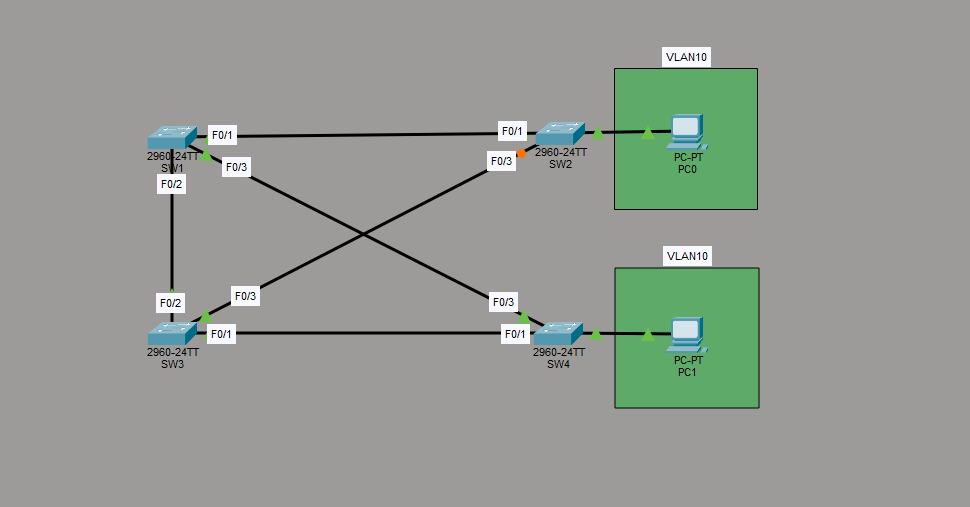

# PVST+ Root Bridge Behavior Across VLANs

## Overview

This lab explores the behavior of Per-VLAN Spanning Tree Plus (PVST+) in a redundant multi-switch topology. It focuses on how Spanning Tree instances are created, how root bridges are elected independently per VLAN, and why trunk links are required for switches to participate in a VLAN’s STP instance — even if they have no access ports in that VLAN.

The topology uses four Layer 2 switches arranged with multiple redundant paths. End devices are placed only in VLAN 10, allowing clear observation of how different root bridges affect (or do not affect) traffic depending on the VLAN.

## Topology

- **SW1** (Top Left) – Distribution switch  
- **SW2** (Top Right) – Access switch (PC0 connected)  
- **SW3** (Bottom Left) – Distribution switch  
- **SW4** (Bottom Right) – Access switch (PC1 connected)

All inter-switch links are configured as trunks. End-user ports on SW2 and SW4 are access ports in VLAN 10.

## Key Concepts Demonstrated

### 1. PVST+ is the Default
Cisco switches run **Per-VLAN Spanning Tree Plus (PVST+)** by default. This means a separate Spanning Tree instance is maintained for every VLAN.

### 2. STP Instance Creation Requires Trunking
Even though VLAN 10 was created on all four switches, the distribution switches (SW1 and SW3) did **not** initially have an active STP instance for VLAN 10.

This is because they had no access ports in VLAN 10 and the links between switches were not yet trunks. Once the inter-switch links were converted to trunks (and `switchport nonegotiate` was applied), VLAN 10 was allowed across those trunks and the STP instance for VLAN 10 appeared on the left-side switches.

**Lesson:** A switch only runs an STP instance for a VLAN if:
- The VLAN exists on the switch, **and**
- The VLAN is allowed on at least one active trunk (or the switch has an access port in that VLAN).

### 3. Independent Root Bridges per VLAN
- **VLAN 10** → SW1 (top left) is the Root Bridge  
- **VLAN 1**  → SW3 (bottom left) is the Root Bridge  

Because both end devices are in VLAN 10, every switch in the path uses SW1 as the root for the traffic that actually matters. SW3 being root for VLAN 1 has no impact on the current topology.

If end devices were later added to VLAN 1, those devices would see SW3 as their root bridge and would choose different root ports accordingly.

### 4. Configuration Choices
- VLANs created manually on all switches
- All inter-switch links configured as static trunks
- `switchport nonegotiate` applied to disable DTP
- No reliance on Dynamic Trunking Protocol (DTP)

## Skills Demonstrated

- Understanding of PVST+ vs classic STP
- Root bridge election per VLAN
- Relationship between trunking and STP instance creation
- Impact of root bridge placement on different VLANs
- Proper static trunk configuration + disabling DTP
- Observing STP behavior in a redundant topology

## Lessons Learned

- Creating a VLAN on a switch is not enough - the VLAN must also be allowed on trunks for remote switches to participate in that VLAN’s STP instance.
- Different VLANs can (and often should) have different root bridges.
- When all end devices are in a single VLAN, only that VLAN’s root bridge matters for actual traffic flow.
- Disabling DTP with `switchport nonegotiate` is a modern best practice, especially in environments where configurations are pushed programmatically.

## Files Included

- `pvst-root-bridge-vlan-behavior.pkt` – Packet Tracer lab file
- `topology.png` – Network topology diagram
