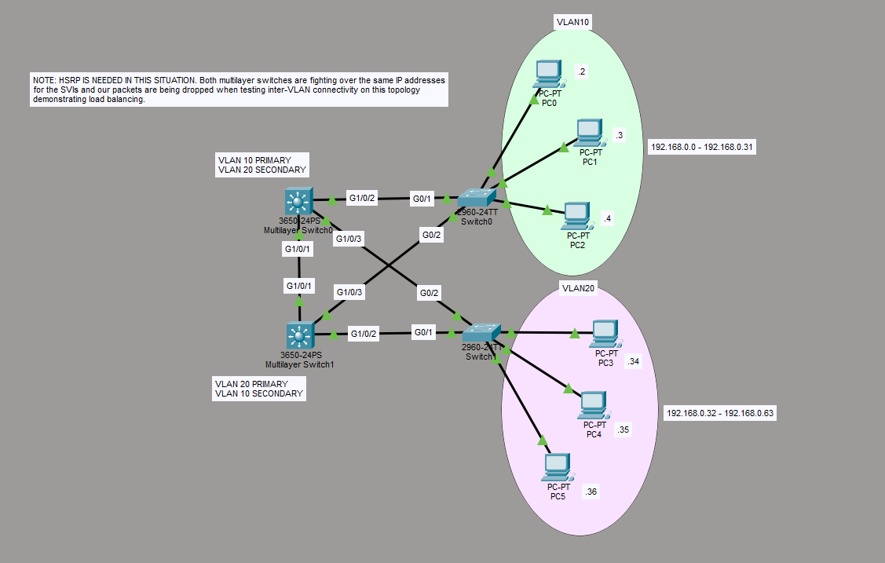

# Dual Multilayer Switch Inter-VLAN Routing – IP Conflict Lab

## Overview

This lab explores what happens when two multilayer switches are both configured with Switch Virtual Interfaces (SVIs) using the **same IP addresses** for the same VLANs, while attempting to perform inter-VLAN routing and basic load balancing.

The goal was to create a redundant distribution layer where:
- Multilayer Switch0 is primary for VLAN 10 and secondary for VLAN 20
- Multilayer Switch1 is primary for VLAN 20 and secondary for VLAN 10

Instead of working, the topology produced an IP address conflict that broke inter-VLAN routing.

## Topology

- Two Cisco 3650 multilayer switches (distribution layer)
- Two Cisco 2960 access switches
- VLAN 10 and VLAN 20
- End devices in both VLANs
- Full Layer 2 redundancy between the multilayer and access switches

## What I Tried

I configured SVIs on **both** multilayer switches for VLAN 10 and VLAN 20 and assigned them the same IP addresses (the intended gateway addresses for each VLAN). I also adjusted Spanning Tree priorities so that each multilayer switch would be preferred for one VLAN.

## Observed Problem

When testing inter-VLAN connectivity (especially in Simulation mode), packets would leave the source switch but fail to reach the destination VLAN cleanly. Pings would eventually time out. The switches appeared to be fighting over the same IP addresses.

## Root Cause

Both multilayer switches were configured with **identical SVI IP addresses** on the same VLANs. 

In a Layer 3 network, two devices cannot claim the same IP address. This creates:
- IP address conflicts
- Unstable ARP behavior
- Unreliable Layer 3 forwarding
- Broken inter-VLAN routing

Even though the switches were trying to forward traffic, the duplicate IPs prevented consistent routing decisions.

## Why “Primary / Secondary” Alone Wasn’t Enough

Simply making one switch the Spanning Tree root for a VLAN does **not** solve the gateway IP problem. End devices need a single, stable default gateway IP. When two switches both claim that IP, the network breaks.

## Correct Solution (Not Yet Implemented)

The proper way to achieve the design I wanted is to use a **First Hop Redundancy Protocol**, specifically:

- **HSRP** (Hot Standby Router Protocol) — Cisco proprietary
- or VRRP / GLBP

With HSRP:
- Both multilayer switches have unique physical IP addresses on their SVIs
- They share a single **virtual IP** (the actual gateway the PCs use)
- One switch is Active and the other is Standby (or you can do per-VLAN active/standby for load balancing)

I have not learned HSRP yet. This lab is intentionally left in the broken state to document the problem and the reasoning behind why HSRP (or an equivalent protocol) is required in this type of design.

## Skills & Lessons Demonstrated

- Configuring SVIs on multilayer switches
- Attempting inter-VLAN routing on redundant L3 switches
- Diagnosing IP address conflicts
- Understanding why two devices cannot share the same IP
- Recognizing the need for First Hop Redundancy Protocols
- Realistic troubleshooting of a design that looks correct on paper but fails in practice

## Current Status

Lab is documented in its **broken** state on purpose.  
Next step: Learn and implement HSRP so both multilayer switches can safely share gateway responsibility without fighting over the same IP addresses.

## Files Included

- `dual-l3-switch-ip-conflict.pkt` – Packet Tracer file (current broken state)
- `topology.png` – Network topology diagram
