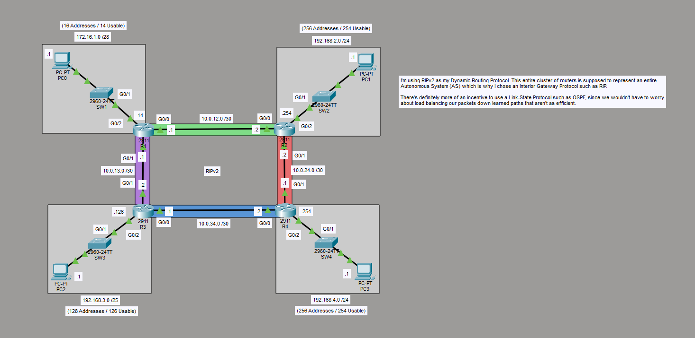

# RIP v2 IGP Lab – Single Autonomous System

## Overview
This lab demonstrates the configuration and operation of **RIP v2** as a dynamic interior gateway protocol (IGP) in a single Autonomous System (AS). The topology simulates an IGP environment where all routers belong to the same AS and exchange routes using distance-vector routing.

Key goals:
- Configure RIP v2 with `no auto-summary` to preserve classless subnet masks
- Use VLSM for efficient IP address allocation across all interfaces
- Observe equal-cost load balancing when multiple paths have the same hop count

The entire cluster of four routers represents one building or campus edge (IGP-style design), not an external ISP.

## Topology

- **Four Cisco 2960/2960T switches** (acting as Layer 3 routers with three GigabitEthernet interfaces each)
- **Six end devices** (PCs) connected to the access layer
- **Two core switches** (R3 and R4) connected via a high-speed 10 Gbps link (blue)
- **Inter-router links** with different subnet masks (purple, green, red, blue) using VLSM
- All routers run **RIP v2**

## Network Design & IP Addressing (VLSM)
- **Top-left subnet**: 172.16.1.0/28 (16 addresses, 14 usable) – SW1
- **Top-right subnet**: 192.168.2.0/24 (256 addresses, 254 usable) – SW2
- **Bottom-left subnet**: 192.168.3.0/25 (128 addresses, 126 usable) – SW3
- **Bottom-right subnet**: 192.168.4.0/24 (256 addresses, 254 usable) – SW4

Core interconnects:
- R3–R4 high-speed link: 10.0.34.0/30
- R3–SW1 link: 10.0.13.0/30
- R4–SW2 link: 10.0.24.0/30
- Core-to-access links: 10.0.12.0/30 and 10.0.34.0/30 (with G0/0–G0/1 interfaces)

## Configuration Highlights
- **RIP v2** enabled on **all four routers** (SW1, SW2, SW3, SW4) as the dynamic routing protocol
- `no auto-summary` configured on all RIP processes
- Version 2 was chosen specifically because RIP v1 cannot carry subnet mask information (pre-CIDR design)
- All GigabitEthernet interfaces were assigned their respective IP addresses
- No redistribution or static routes were needed — full dynamic convergence via RIP

## Observed Behavior – Equal-Cost Load Balancing
- When pinging between the top-left PC (PC-PT PC0) and top-right PC (PC-PT PC1), both learned paths have **identical hop count (2)**
- RIP metric (hop count) is exactly the same on both equal-cost paths
- Traffic is **automatically load-balanced** across the two links (green link 10.0.12.0/30 and red link 10.0.24.0/30)
- This demonstrates classic equal-cost multipath (ECMP) behavior with RIP v2

**Note**: In a real IGP (e.g., OSPF), path selection would be based on cost rather than hop count, but the principle of load balancing multiple equal-cost paths remains the same.

## Skills & Lessons Demonstrated
- Configuring and enabling RIP v2 with `no auto-summary`
- Using VLSM for address-efficient design in an IGP
- Diagnosing and observing equal-cost load balancing
- Understanding why RIP v2 is preferred over RIP v1 in modern classless networks
- Real-world troubleshooting of dynamic routing in a single AS

## Current Status
Lab is working and fully operational in Packet Tracer.  
The design intentionally uses RIP v2 to illustrate classic distance-vector behavior and load balancing inside one autonomous system.

## Files Included
- `rip-v2-single-as.pkt` – Packet Tracer simulation file (current working state)
- `topology.png` – Network topology diagram
