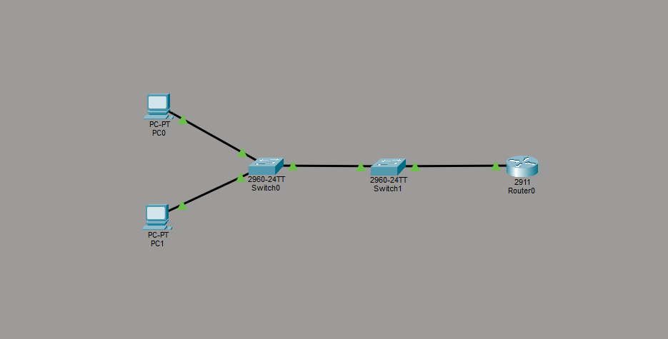

# NOC Troubleshooting Lab – Missing VLANs on Trunked Switch

## Overview
Devices in VLANs 10 and 20 on Switch1 could not communicate across switches or reach their default gateways, while devices on Switch0 functioned normally.

## Topology


## Symptoms 
- VLAN 10 and VLAN 20 devices could not ping each other ❌  
- Inter-VLAN routing failed for devices connected to Switch2 ❌

## Troubleshooting Process
1. Verified device IP configuration on PCs  
   ```bash
   ipconfig /all   # On PCs
   ping [gateway IP]
   ```
   Observed that devices on Switch1 could not reach the gateway.  

2. Checked trunk status on Switch1  
   ```bash
   show interfaces trunk
   ```
   - Trunk links were up  
   - VLANs 10 and 20 not passing → issue suspected on Layer 2  

3. Checked VLANs on Switch1  
   ```bash
   show vlan brief
   ```
   - VLANs 10 and 20 were **missing** → traffic for these VLANs dropped  

4. Created missing VLANs on Switch1  
   ```bash
   conf t
   vlan 10
   name VLAN10
   vlan 20
   name VLAN20
   end
   ```

5. Ensured trunk ports allowed VLANs 10 and 20  
   ```bash
   interface g0/1   # Trunk to Switch1
   switchport trunk allowed vlan 10,20

   interface g0/2   # Trunk to Router
   switchport trunk allowed vlan 10,20
   end
   ```

6. Verified connectivity  
   ```bash
   show vlan brief
   ping [gateway IP]        # On PC2
   ping [other VLAN IP]     # Inter-VLAN ping
   ```
   - Ping now successful  
   - Traffic flows correctly between VLANs  

## Root Cause
- VLANs 10 and 20 were not created on Switch2, causing frames tagged with those VLANs to be dropped.  
- Trunk ports were not configured to explicitly allow all required VLANs.  

## Fix Applied
1. Created VLANs 10 and 20 on Switch1  
2. Configured trunk ports between Switch0↔Switch1 and Switch2↔Router to allow VLANs 10 and 20  
3. Verified end-to-end connectivity  

## Verification
| Test | Result |
|------|--------|
| PC2 → Gateway | ✅ Successful |
| PC2 → PC1 (Inter-VLAN) | ✅ Successful |
| `show vlan brief` on Switch1 | ✅ VLANs 10 & 20 exist |
| `show interfaces trunk` | ✅ VLANs 10 & 20 allowed |

## Lessons Learned
- VLANs must exist on **all switches** in the network, even if the trunk is up  
- Always verify trunk **allowed VLANs** to ensure Layer 2 traffic passes  
- Layer 2 misconfigurations can appear as inter-VLAN or gateway failures → **check VLANs before troubleshooting routing**
